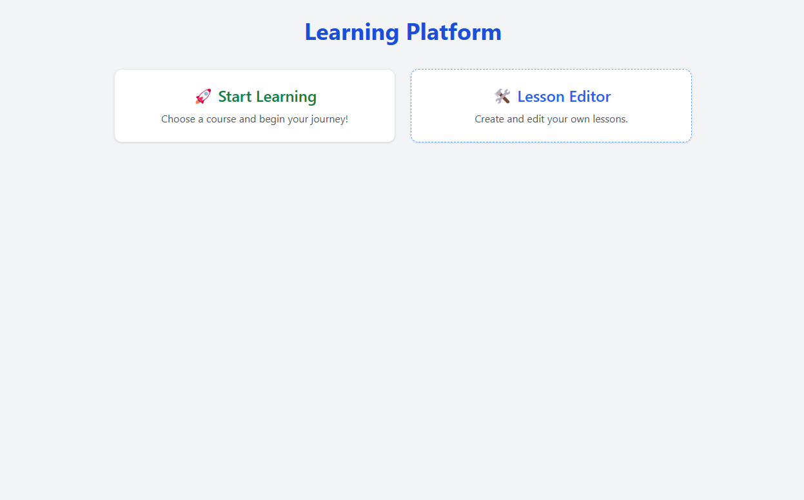
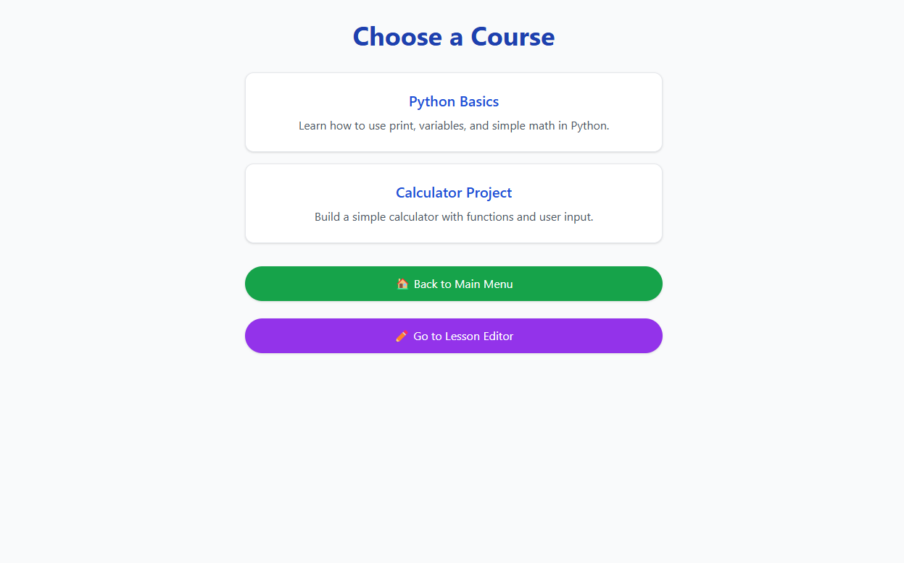
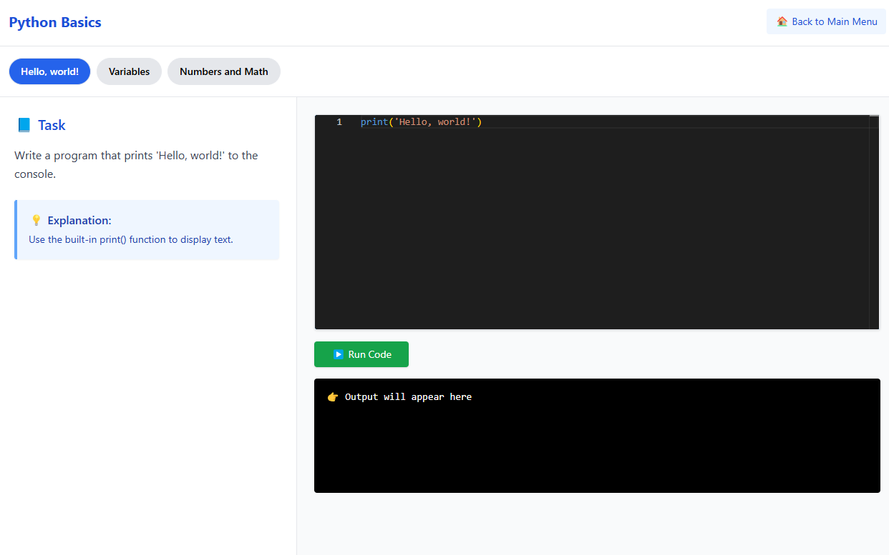
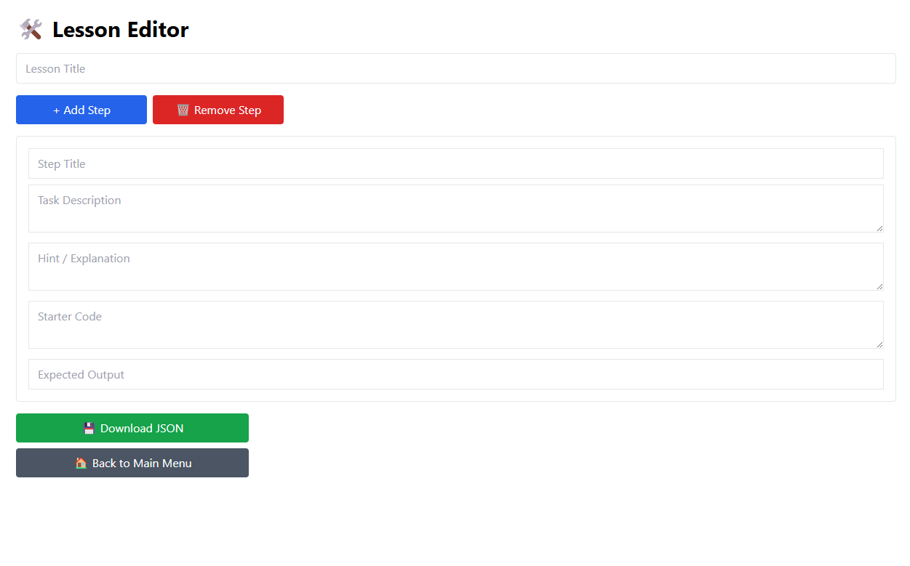

# 🧠 Coding Courses Platform

An interactive web application designed to teach Python programming through engaging, step-by-step lessons. Users can read theory, write and run code live in the browser, and get instant feedback. The platform features a beautiful interface, roadmap-style navigation, an integrated code editor, and a built-in lesson editor for course creators.

The frontend is built entirely in React, styled with Tailwind CSS, and uses the Monaco Editor for code input. Code execution is handled in real-time via the Judge0 API. All lesson data is stored as editable `.json` files in the `../lessons/` directory. Progress is saved locally using the browser’s LocalStorage.

## 🚀 Getting Started

```bash
cd Path To Source Code
npm install
npm run dev
```

Then open [http://localhost:5173](http://localhost:5173) in your browser 🎉

## 📦 Technologies Used

- ⚛️ React
- 🧩 React Router DOM
- 💅 Tailwind CSS
- 💻 Monaco Editor
- 🧪 Judge0 API (via RapidAPI)
- 💾 LocalStorage

## 📁 Project Structure

```
../
└── lessons/
    ├── index.json
    ├── python_basics.json
    └── calculator_project.json

../src/
└── pages/
    ├── Home.jsx
    ├── Lesson.jsx
    ├── Editor.jsx
    └── MainMenu.jsx
```

## 📚 Creating Lessons

You can create lessons manually or using the visual editor at `/editor`.

### Example JSON lesson format:

```json
{
  "title": "Python Basics",
  "steps": [
    {
      "title": "Hello, world!",
      "description": "Print 'Hello, world!'",
      "starterCode": "print('Hello, world!')",
      "explanation": "Use the print() function.",
      "tests": [{ "expectedOutput": "Hello, world!" }]
    }
  ]
}
```

## ⚙️ Judge0 API Setup

- Visit: https://rapidapi.com/judge0-official
- Copy your API key
- Paste it in `Lesson.jsx`:

```js
"X-RapidAPI-Key": "your-api-key",
```

## ✅ Features

- Roadmap with progress tracking
- Instant test result display
- Beautiful Monaco code editor
- Create & download lessons in JSON format
- Supports multiple steps per lesson

## 🖼 Screenshots

### 🧭 Main Menu



### 📚 Course List (Home Page)



### 🎯 Lesson View (Code Editor + Task)



### 🛠 Lesson Editor Interface


